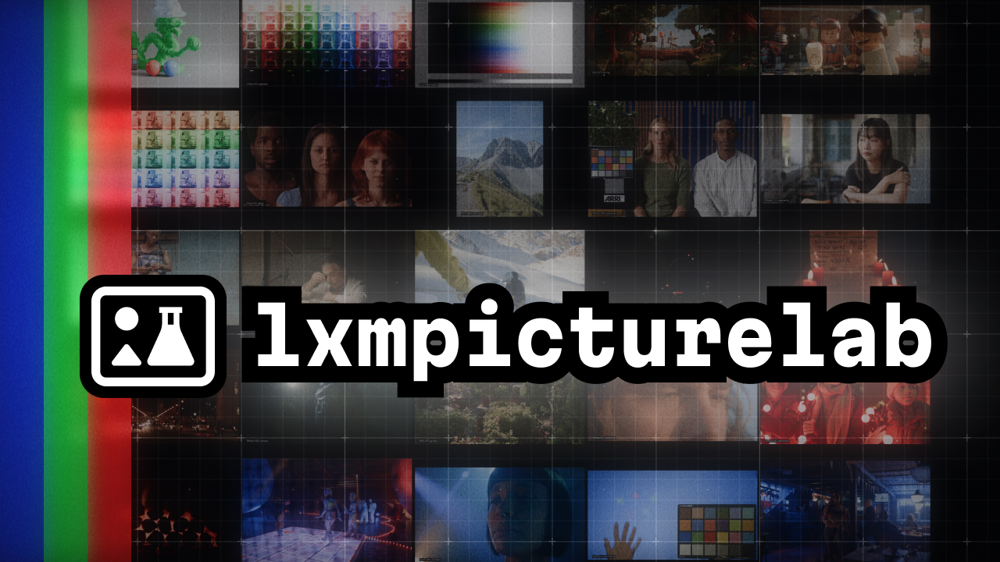

# lxmpicturelab

Compare and experiment with different picture formation algorithms using
various image sources.



The results are published to https://mrlixm.github.io/lxmpicturelab.

> ⚠️ This repository is currently partially public, the source image assets
> are not version-controlled yet.

## what

These are the tasks this repository defines:

1. stores photographic and cgi image source assets retrieved from external web
   sources.
    - generate consistent metadata for them
    - uniformize them (size, file format, encoding, ...)
2. combine all those assets to a single "set" image (a mosaic).
3. render those image through picture formation algorithm with a consistent
   workflow allowing visual comparison between those generations.
4. run and publish the results to a static website

All those tasks match an executable python script:

1. [asset-in-ingest.py](scripts/asset-in-ingest.py)
2. [sets-generate.py](scripts/sets-generate.py)
3. [comparisons-generate.py](scripts/comparisons-generate.py)
4. [site-build.py](site/site-build.py)

## scripts usage

### pre-requisites

- [uv](https://docs.astral.sh/uv/) for python project management
- [git](https://git-scm.com/downloads) for doc publish / contributing to this
  repo

preparation:

- download this repository anywhere on your system
- `cd path/to/repo`
- `uv sync` : create the python virtual environment

To run a script you can use the following template:

```
uv run script/path/scriptname.py
```

### asset-in-ingest.py

⚠️ This script requires you for now to manually download each image source
from its url listed the json metadata file.

You can then check the README in [assets/](assets) to better understand the
asset workflow.

### sets-generate.py

This scripts requires the assets in [assets/](assets) to exists.

The current configuration will combine all the existing assets found in the
directory.

You can create additional variants by editing the global variable
`SET_VARIANTS` and adding it a new `SetVariant` instance. You can restrict
which assets are combine by setting the `SetVariant.asset_filter` field.

The output of this script is found at [sets/](sets) (currently not
version-controlled).

### comparisons-generate.py

This script use the image file generated by previous scripts but can actually
work with external image file sources.

It is however more complex to customize its behavior. The source assets used
are defined in its `build_source_assets` function.

The picture formation algorithm are represented by a "renderer" which are defined
in the `build_renderers` function.

By default, the comparison results are stored in an [.workbench/](.workbench)
directory at root. You can change those with the command line interface.
Use `uv run comparisons-generate.py --help` to display its documentation.

### site-build.py

Creates a static html website with the images generated by `comparisons-generate.py`.

The html is manually authored, with the help of Jinja2 templating.

The comparisons results will be stored in a different directory but only need
to be generated once. You can then quickly rebuild the html website without
waiting for the long comparisong process.
